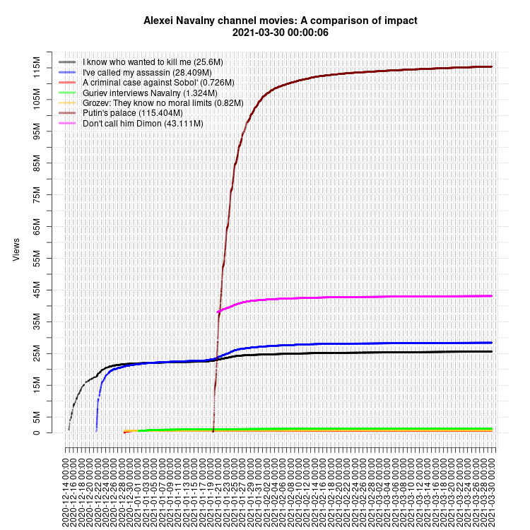
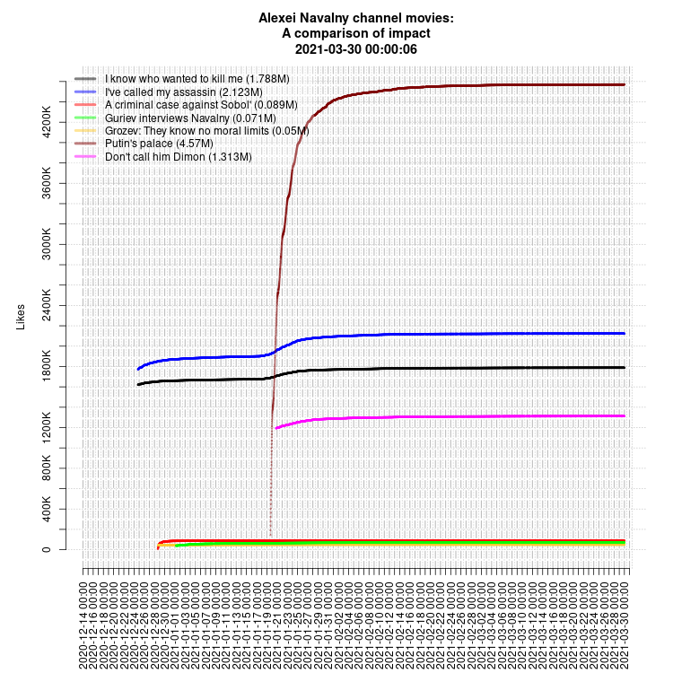
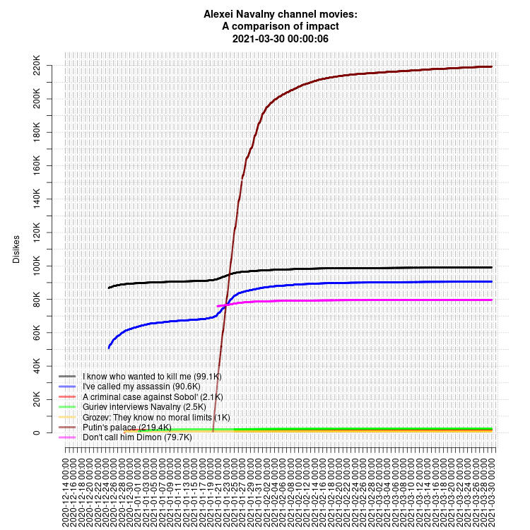
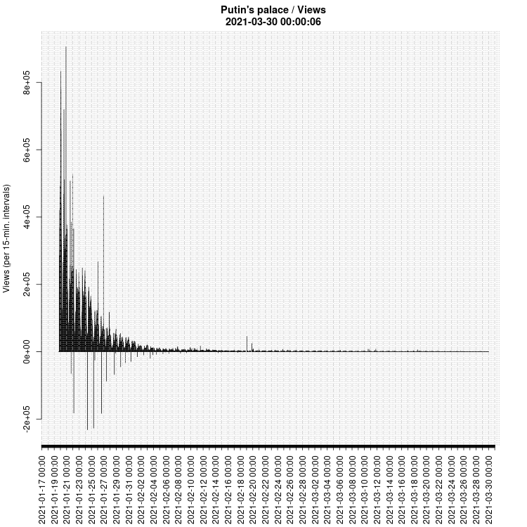
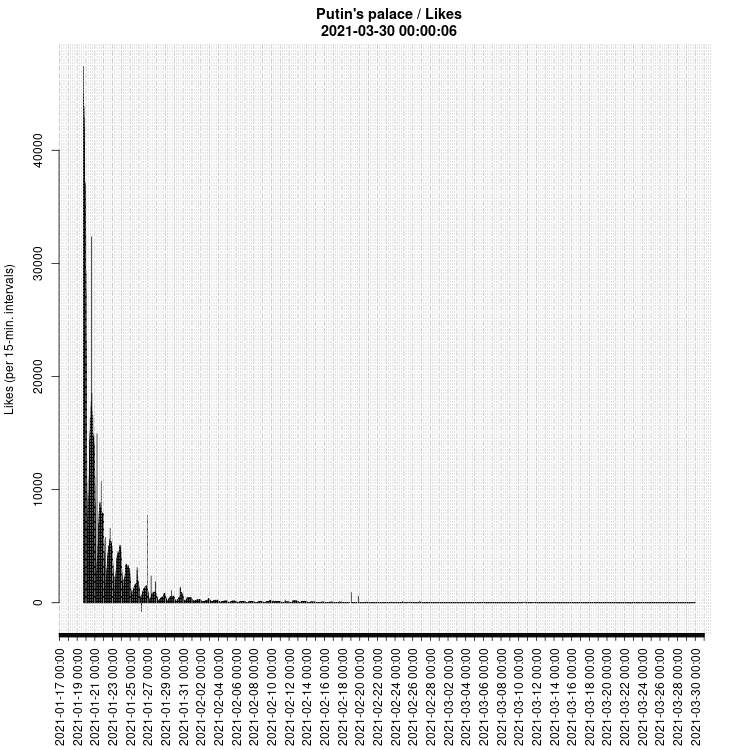
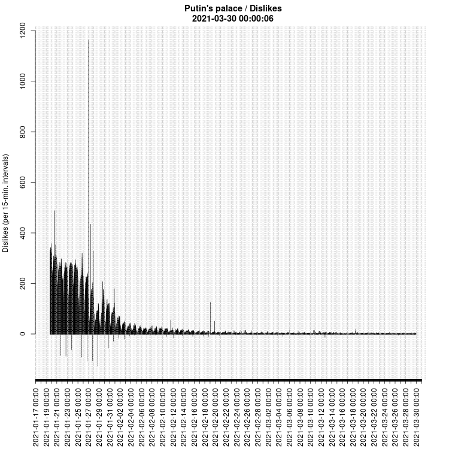
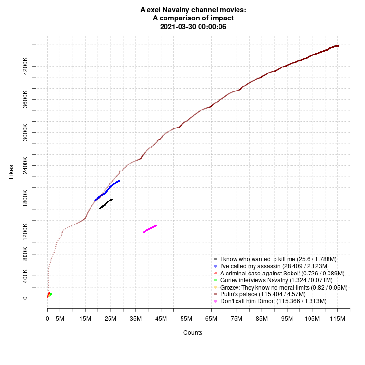
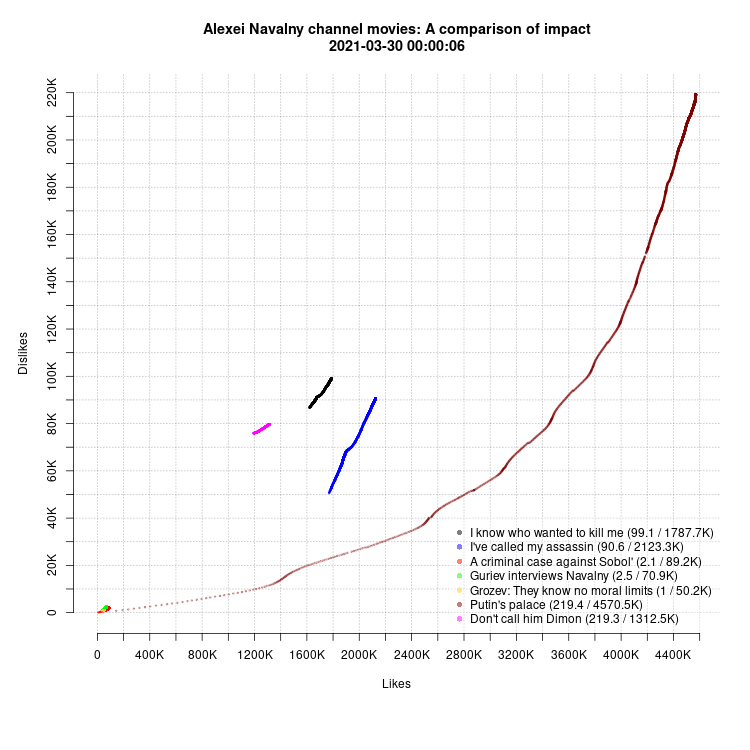

# Youtube tracker

Data and scripts for a simple YouTube tracker by Alexei Kouprianov. Initially created to track a few of movies by Alexei Navalny published on YouTube.

## Data collection

Initially, the data were collected manually, then, from 2020-12-24 18:31 MSK through 2020-12-25 00:00 MSK with a manually run script `scripts/youtube.stats.pl`, from that point on they have been collected with a script which runs every 15 min. by `cron`.

The script `scripts/youtube.stats.pl` takes a list of YouTube URLs from `scripts/urllist.txt`, extracts `view`, `like` and `dislike` counts from the URLs specified, and prints them to `downloads/pages.processed.02.txt` as a tab-delimited text.

## Plotting

The script `scripts/yt_plotter.r` reads data from `data/youtube.txt` and `downloads/pages.processed.02.txt`, combines them, and plots basic visualizations to `plots/`.

## Example plots

